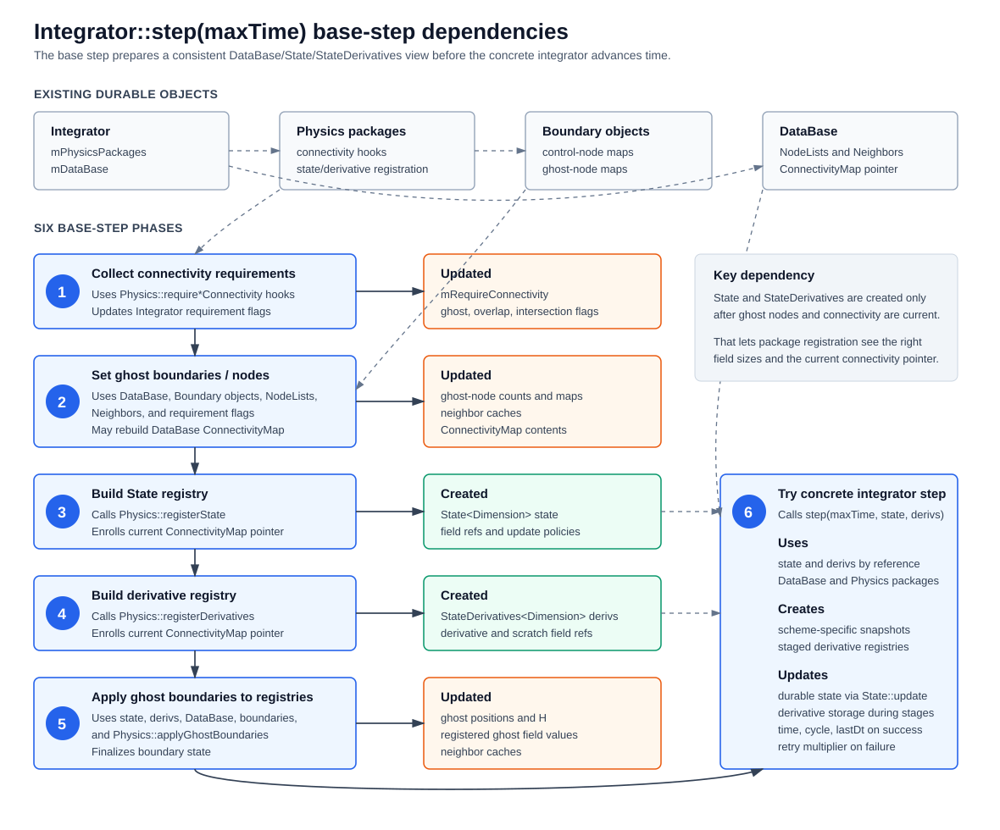

Integrator and State Update Model
=================================

Purpose
-------

This document describes the C++ integrator subsystem and the supporting
``State``/``StateDerivatives`` object model in developer-facing detail. It
builds on :doc:`simulation_lifecycle_and_main_loop`: that document explains
the overall simulation lifecycle, while this one focuses on the internal
contracts that make time advancement work.

The central design point is that Spheral separates three concerns:

* the base ``Integrator`` owns shared step mechanics;
* concrete integrators own numerical time centering;
* ``State`` update policies own field-specific update semantics.

That separation is what lets one physics package participate in several
integrators without teaching each integrator how to update pressure, density,
velocity, damage, strength state, or package-specific derived fields.

Source Map
----------

The main files involved are:

* ``src/Integrator/Integrator.hh`` and ``src/Integrator/Integrator.cc``:
  common time-step entry point, package list, boundary handling, connectivity
  setup, ``dt`` selection, retry logic, and shared package hooks.
* ``src/Integrator/ForwardEuler.cc``, ``SynchronousRK2.cc``,
  ``CheapSynchronousRK2.cc``, ``PredictorCorrector.cc``, and ``Verlet.cc``:
  explicit time-centering implementations.
* ``src/Integrator/ImplicitIntegrator.hh``,
  ``src/Integrator/ImplicitIntegrator.cc``,
  ``src/Integrator/BackwardEuler.cc``, and
  ``src/Integrator/ImplicitIntegrationVectorOperator.cc``: implicit
  integration support.
* ``src/Physics/Physics.hh`` and ``src/Physics/Physics.cc``: package contract
  used by integrators.
* ``src/DataBase/StateBase.hh``, ``StateBase.cc``, and
  ``StateBaseInline.hh``: common registry and lookup implementation for
  ``State`` and ``StateDerivatives``.
* ``src/DataBase/State.hh``, ``State.cc``, and ``StateInline.hh``:
  state registry plus update-policy dependency resolution.
* ``src/DataBase/StateDerivatives.hh`` and ``StateDerivatives.cc``:
  derivative registry and derivative zeroing.
* ``src/DataBase/UpdatePolicyBase.hh`` and concrete policy classes such as
  ``IncrementState``, ``ReplaceState``, ``PureReplaceState``,
  ``IncrementBoundedState``, ``ReplaceBoundedState``, ``MaxReplaceState``, and
  package-specific policies.
* Representative package implementations such as ``src/SPH/SPHBase.cc``,
  ``src/SPH/SPH.cc``, and ``src/CRKSPH/CRKSPHBase.cc`` show how packages
  register durable fields, derivative fields, and policies.

Step Ownership
--------------

There are two ``step`` methods in the integrator hierarchy, and their
responsibilities are intentionally different.

``Integrator<Dimension>::step(maxTime)``
  Is the public C++ entry point normally called from Python bindings. It
  performs shared setup: gathers connectivity requirements, creates ghosts,
  builds transient ``State`` and ``StateDerivatives`` registries, applies ghost
  boundaries, and retries the concrete step if a time-step check fails.

``ConcreteIntegrator<Dimension>::step(maxTime, state, derivs)``
  Is implemented by each numerical method. It selects a concrete ``dt``, orders
  derivative evaluations, calls ``State::update`` one or more times, handles
  trial-state rejection, and advances the integrator clock on success.

The base method owns the stable skeleton. The derived method owns the
time-centering scheme. Neither layer owns the equations of motion; those live
in ``Physics`` packages and their update policies.

The shared base entry point has the following shape:

::

   bool Integrator::step(maxTime):
       query package connectivity requirements

       if currentCycle % updateBoundaryFrequency == 0:
           setGhostNodes()

       State state(dataBase, packages)
       StateDerivatives derivs(dataBase, packages)

       applyGhostBoundaries(state, derivs)

       for retry in 1..10:
           success = derived.step(maxTime, state, derivs)
           if success:
               break
           dtMultiplier *= 0.5

       dtMultiplier = 1.0
       return success

Base Step Dependency Diagram
~~~~~~~~~~~~~~~~~~~~~~~~~~~~

The public base step builds the shared object context before any concrete
time-centering method runs. The objects mostly already live in the
``DataBase``, ``NodeList`` objects, ``Physics`` packages, and ``Boundary``
objects. The base step creates transient registries over those objects, applies
ghost field values, and then gives the concrete integrator a consistent view.

   Dependency flow for the six shared phases in
   ``Integrator<Dimension>::step(maxTime)``.

::

   Existing durable objects
   ------------------------

   Integrator
     |-- mPhysicsPackages --> Physics packages --> Boundary objects
     `-- mDataBase        --> DataBase --> NodeLists, Neighbors, ConnectivityMap

   (1) Collect Connectivity Requirements
       uses:    Physics packages
       updates: Integrator requirement flags
                mRequireConnectivity
                mRequireGhostConnectivity
                mRequireOverlapConnectivity
                mRequireIntersectionConnectivity
              |
              v

   (2) Set Ghost Boundaries / Nodes
       uses:    DataBase, Boundary objects, NodeLists, Neighbors,
                requirement flags
       updates: NodeList ghost-node counts
                Boundary control-node and ghost-node maps
                Neighbor node caches
                DataBase ConnectivityMap, when required
              |
              v

   (3) Build State Registry
       creates: State<Dimension> state
       uses:    DataBase, Physics packages, current ConnectivityMap pointer
       updates: state registry entries and update policies through
                Physics::registerState
              |
              v

   (4) Build Derivative Registry
       creates: StateDerivatives<Dimension> derivs
       uses:    DataBase, Physics packages, current ConnectivityMap pointer
       updates: derivative registry entries through
                Physics::registerDerivatives
              |
              v

   (5) Apply Ghost Boundaries to New State / Derivatives
       uses:    state, derivs, DataBase, Boundary objects, Physics packages
       updates: ghost positions and H fields
                Neighbor node caches
                registered ghost field values in state and derivs
              |
              v

   (6) Try New Integrator Step
       uses:    state, derivs, DataBase, Physics packages
       creates: concrete-integrator temporaries, such as snapshots or
                staged derivative registries
       updates: durable fields through State::update
                derivative storage during staged evaluations
                integrator time, cycle, and lastDt on success
                retry multiplier on failure

.. list-table:: Object lifecycle in the public base step
   :header-rows: 1
   :widths: 18 22 30 30

   * - Step
     - Created
     - Used
     - Updated
   * - Collect connectivity requirements
     - None
     - ``mPhysicsPackages`` and each package's ``require*Connectivity`` hooks
     - Integrator requirement flags
   * - Set ghost boundaries / nodes
     - Ghost-node entries and connectivity contents as needed
     - ``DataBase``, ``NodeList`` objects, ``Neighbor`` objects, unique
       ``Boundary`` objects, and requirement flags
     - Ghost counts, boundary control/ghost maps, neighbor caches, and
       ``DataBase::connectivityMap()``
   * - Build state registry
     - ``State<Dimension> state``
     - ``DataBase``, physics packages, and current connectivity pointer
     - State registry entries, field references, and update policies
   * - Build derivative registry
     - ``StateDerivatives<Dimension> derivs``
     - ``DataBase``, physics packages, and current connectivity pointer
     - Derivative registry entries and field references
   * - Apply ghost boundaries to new registries
     - Usually none
     - ``state``, ``derivs``, ``DataBase``, boundaries, and physics packages
     - Ghost positions, ghost ``H`` values, neighbor caches, and registered
       ghost field values
   * - Try concrete integrator step
     - Scheme-specific temporaries
     - ``state``, ``derivs``, ``DataBase``, and physics packages
     - Durable state fields, derivative storage, and integrator bookkeeping

The derived method receives registries that refer to durable data owned
elsewhere. Any field changes made through ``state`` mutate the underlying
``NodeList`` or package-owned fields.

Integrator Base Object
----------------------

``Integrator<Dimension>`` stores:

* a reference to the active ``DataBase``;
* the ordered vector of ``Physics`` package pointers;
* time controls: ``dtMin``, ``dtMax``, ``dtGrowth``, ``lastDt``,
  ``dtCheckFrac``, ``currentTime``, and ``currentCycle``;
* retry state through ``mDtMultiplier``;
* boundary cadence through ``updateBoundaryFrequency``;
* connectivity requirement flags collected from physics packages;
* ghost culling and domain-decomposition options;
* restart registration for integrator time bookkeeping.

Physics packages are appended through ``appendPhysicsPackage``. That method
also inserts any package-declared pre- or post-subpackages, so the integrator's
package order is the final execution order. The controller may also insert
support packages before the integrator is constructed or before advancement
begins.

The base class exposes common hooks used by concrete integrators:

``preStepInitialize``
  Calls ``Physics::preStepInitialize`` on each package once at the beginning of
  a concrete step.

``selectDt``
  Queries each package for a ``dt`` vote, keeps the smallest positive vote,
  applies the retry multiplier, applies the growth limit, clamps to the
  requested bounds, and optionally reduces to a global MPI minimum.

``initializeDerivatives``
  Clears the database work field, calls ``Physics::initialize`` on each
  package, and reapplies ghost boundaries if any package requests it.

``evaluateDerivatives``
  Calls ``Physics::evaluateDerivatives`` on each package.

``finalizeDerivatives``
  Calls ``Physics::finalizeDerivatives`` on each package after all derivative
  contributions have been evaluated.

``postStateUpdate``
  Calls ``Physics::postStateUpdate`` after state has changed and reapplies
  ghost boundaries if any package requests it.

``postStepFinalize``
  Calls ``Physics::finalize`` once at the end of a completed step.

``setGhostNodes``, ``applyGhostBoundaries``, and ``enforceBoundaries``
  Coordinate boundary-created ghosts, ghost field updates, violation nodes, and
  package-specific boundary behavior.

The concrete integrator should use these hooks instead of directly iterating
over packages unless it is deliberately changing the shared protocol.

Concrete Integrators
--------------------

All current explicit integrators follow the same high-level loop:

1. read current time and database;
2. call ``preStepInitialize``;
3. select a ``dt``;
4. initialize, zero, evaluate, and finalize derivatives;
5. call ``state.update`` according to the method's time centering;
6. apply and finalize ghost boundaries after state changes;
7. run post-update and finalization hooks;
8. enforce boundaries;
9. advance ``currentTime``, ``currentCycle``, and ``lastDt`` on success.

The methods differ in how many derivative evaluations they perform and what
state snapshot they restore before the final update.

``ForwardEuler``
~~~~~~~~~~~~~~~~

``ForwardEuler`` is the simplest method:

1. evaluate derivatives at the beginning state;
2. call ``state.update(derivs, dt, t, dt)``;
3. apply boundaries and post-update hooks;
4. finalize the step.

It is useful as a reference for the minimal integrator contract because there
is no trial midpoint or corrector state.

``SynchronousRK2``
~~~~~~~~~~~~~~~~~~

``SynchronousRK2`` performs a midpoint Runge-Kutta update:

1. evaluate beginning derivatives;
2. copy ``state`` to ``state0`` and call ``state0.copyState``;
3. trial-update the live state by ``0.5 * dt``;
4. evaluate midpoint derivatives;
5. optionally reject the step if the new ``dt`` vote is too small;
6. restore from ``state0``;
7. update by the full ``dt`` using midpoint derivatives.

The important implementation detail is the snapshot. A normal ``State`` copy is
reference-based. ``copyState`` is required when an integrator needs an owned
snapshot for trial-state restore.

``CheapSynchronousRK2``
~~~~~~~~~~~~~~~~~~~~~~~

``CheapSynchronousRK2`` is a midpoint-style method optimized to avoid a full
extra end-of-step derivative evaluation. It sets ``state.timeAdvanceOnly(true)``
for the midpoint predictor so replacement-style policies are forced through
``updateAsIncrement`` where possible. After midpoint derivative evaluation it
restores the original state, disables ``timeAdvanceOnly``, and advances by the
full ``dt``.

This method is the main reason ``UpdatePolicyBase`` has both ``update`` and
``updateAsIncrement``. Some policies can replace state when derivatives are
fresh and properly centered, but must degrade to incremental time advancement
when derivative information is being reused as a predictor.

``PredictorCorrector``
~~~~~~~~~~~~~~~~~~~~~~

``PredictorCorrector`` stores both the beginning state and beginning
derivatives:

1. evaluate beginning derivatives;
2. copy ``state0`` and ``derivs0`` with ``copyState``;
3. predictor-update to the end of the step;
4. evaluate end-of-step derivatives;
5. restore from ``state0``;
6. apply half of ``derivs0`` and half of the end derivatives.

The method uses ``copyGhostState`` before restoring the beginning state so ghost
position and ``H`` state can be carried across the corrector staging.

``Verlet``
~~~~~~~~~~

``Verlet`` is specialized around position and velocity time centering:

1. copy beginning positions;
2. evaluate beginning derivatives;
3. predict a midpoint state by a half-step update;
4. copy the midpoint state;
5. compute end positions from beginning positions plus midpoint velocity;
6. predict an endpoint state and override positions with the centered
   positions;
7. evaluate endpoint derivatives;
8. restore the midpoint state;
9. correct the final state by a half-step using endpoint derivatives and keep
   the centered endpoint positions.

This method shows that concrete integrators may manipulate selected fields
directly when a numerical scheme requires it. The exception is narrow:
field-specific physics semantics still belong in update policies.

Implicit Integrators
--------------------

Implicit integration adds two concepts to the same object model:

* some state policies are marked as independent unknowns;
* the integrator solves for those unknowns such that a residual equation is
  satisfied.

``ImplicitIntegrator`` inherits from ``Integrator`` and overrides two major
behaviors:

``step(maxTime)``
  Builds ``State`` and ``StateDerivatives`` and retries the concrete implicit
  step by adjusting ``mDtMultiplier``. A successful implicit step can grow the
  multiplier up to ``mMaxAllowedDtMultiplier``; a failed solve reduces it.

``selectDt``
  Queries both ``Physics::dt`` and ``Physics::dtImplicit``. The explicit vote
  remains the baseline, while the implicit vote limits the multiplier so the
  chosen step does not exceed package-declared implicit bounds.

``computeResiduals`` asks every package for ``maxResidual`` and returns the
global maximum. Packages that do not support implicit advancement should leave
the default ``maxResidual`` behavior in place, which raises an error.

``BackwardEuler`` implements the current implicit concrete method. It starts
with explicit RK2-like advancement for early cycles or when the multiplier is
below one. Once enough history exists and the multiplier is suitable, it:

1. evaluates beginning derivatives and copies ``state0`` and ``derivs0``;
2. creates an initial end-of-step guess with a forward-Euler and
   Crank-Nicolson-style predictor;
3. serializes independent state into a vector of doubles;
4. builds a ``KINSOL`` solver and an ``ImplicitIntegrationVectorOperator``;
5. solves for independent state;
6. restores ``state0`` and applies the final update using solved derivatives;
7. stores serialized state history for future predictions.

``ImplicitIntegrationVectorOperator`` is the adapter between Spheral state and
the nonlinear solver. Given a candidate vector ``x`` it:

1. deserializes ``x`` into independent fields;
2. calls ``state.update(..., dependentOnly=true)`` so dependent state follows;
3. applies ghost boundaries and post-update hooks;
4. evaluates derivatives at the candidate state;
5. serializes derivative values for independent fields;
6. computes the residual

::

   x - x0 - dt * ((1 - beta) * derivs0 + beta * derivs(x))

The implicit machinery therefore reuses the same policies, derivative
registries, and package hooks as explicit integration. The extra requirement is
that independent policies must know how to serialize their state and
derivatives.

StateBase: Registry and Storage
-------------------------------

``StateBase<Dimension>`` is the common implementation behind ``State`` and
``StateDerivatives``. It is a typed registry keyed by strings.

The key data members are:

``mStorage``
  ``std::map<KeyType, std::any>``. Entries usually hold
  ``std::reference_wrapper<T>`` so the registry points at existing state rather
  than owning it.

``mCache``
  ``std::list<std::any>`` used when the registry must own something, such as
  cloned fields from ``copyState`` or shared-pointer enrolled fields.

``mNodeListPtrs``
  Set of node lists represented by registered fields.

``mConnectivityMapPtr``
  Shared pointer to the current ``ConnectivityMap``.

``mMeshPtr``
  Shared pointer to an enrolled mesh, with a default mesh allocated by the
  default constructor.

Field keys follow one convention:

::

   fieldName|nodeListName

``StateBase::key(field)`` builds that full key from the field name and its node
list name. ``StateBase::key(fieldList)`` uses the first field's name plus the
update-policy wildcard:

::

   fieldName|*

The wildcard key is a policy key, not a stored field for every node list.

The map ordering is used deliberately. ``fields(name)`` searches from the
prefix ``name + "|"`` and appends every registered field whose full key starts
with that prefix. This provides an efficient way to reconstruct a ``FieldList``
view over per-node-list fields registered under the same field name.

Reference Versus Copy Semantics
-------------------------------

The most common ``StateBase`` entries are references:

::

   mStorage[key] = std::ref(field_or_object)

That means a plain copy of ``State`` or ``StateDerivatives`` copies references.
The copied registry still points at the same durable fields as the original.

There are three different copy-like operations:

Plain copy constructor or assignment
  Copies the registry by reference. This is cheap and is useful when a function
  wants another handle to the same underlying fields.

``assign(rhs)``
  Copies values from the registered objects in ``rhs`` into the corresponding
  registered objects in ``this``. It uses an ``AnyVisitor`` over supported
  field, scalar, vector, tensor, pairwise-field, and vector types. Connectivity
  is copied by shared pointer; meshes are copied by value.

``copyState()``
  Replaces referenced entries with owned clones stored in ``mCache``. Field
  entries are cloned through ``FieldBase::clone``; supported non-field entries
  are copied into shared objects stored in the cache. After this call the
  registry is an owned snapshot suitable for trial-state restore.

Concrete integrators rely on this distinction. For example:

::

   State state0(state);   // reference copy
   state0.copyState();    // now state0 owns a snapshot
   ...
   state.assign(state0);  // restore values into durable fields

For new integrator work, missing ``copyState`` after a trial snapshot is a
common source of subtle bugs: the snapshot will track the live fields instead
of preserving the beginning-of-step values.

State Construction
------------------

Constructing ``State`` is not just allocation. It executes package registration:

::

   State(dataBase, packageBegin, packageEnd):
       for each package:
           package->registerState(dataBase, *this)
       if dataBase.connectivityMapPtr():
           enrollConnectivityMap(dataBase.connectivityMapPtr())

``StateDerivatives`` has the analogous construction path:

::

   StateDerivatives(dataBase, packageBegin, packageEnd):
       for each package:
           package->registerDerivatives(dataBase, *this)
       if dataBase.connectivityMapPtr():
           enrollConnectivityMap(dataBase.connectivityMapPtr())

Packages are expected to keep durable storage in node lists or package member
fields, then register references to that storage each step. The constructors
are called every step, so registration should resize existing package fields
when necessary rather than creating new long-lived objects each time.

Representative package registration from SPH/CRKSPH follows this pattern:

* resize package-owned field lists such as pressure, sound speed, entropy, and
  derivative scratch fields to match the current database;
* enroll node-list-owned mass, position, velocity, density, ``H``, and thermal
  energy fields;
* enroll package-owned derived fields such as pressure and sound speed;
* attach update policies to fields that should be recomputed or advanced by
  ``State::update``;
* enroll derivative fields with names that match the update-policy lookup
  convention.

State and Derivative Responsibilities
-------------------------------------

``State`` and ``StateDerivatives`` use the same registry mechanics but represent
different phases of the calculation.

``State``
  Carries state fields and policy metadata. Many entries reference durable
  fields on ``NodeList`` objects or package-owned fields. ``State::update`` is
  allowed to mutate those fields.

``StateDerivatives``
  Carries derivative, replacement, scratch, and pairwise data. Integrators
  usually call ``derivs.Zero()`` before derivative evaluation. Packages then
  fill these entries in ``evaluateDerivatives`` and finish them in
  ``finalizeDerivatives``.

Derivative zeroing is type-driven. ``StateDerivatives::Zero`` builds an
``AnyVisitor`` that knows how to zero registered fields, primitive dimension
types, vectors of dimension types, sets, and supported ``PairwiseField``
entries. Some registered objects, such as reproducing kernels, intentionally
have no zero action.

Update Policy Model
-------------------

``UpdatePolicyBase`` is the field update interface. A policy defines:

* ``update(key, state, derivs, multiplier, t, dt)``;
* optional ``updateAsIncrement`` behavior for predictor paths;
* dependency field names;
* whether the policy should be applied per field when registered with a
  ``FieldList``;
* whether the policy represents independent state for implicit integration;
* serialization hooks for implicit integration.

``State`` stores policies separately from the field registry:

::

   mPolicyMap[fieldName][fullFieldKey] = policy

The outer key is the unmangled field name. The inner key is either a full
``fieldName|nodeListName`` key or a wildcard ``fieldName|*`` key. This layout
lets ``State::update`` reason about dependencies at the field-name level while
still applying policies to specific node-list fields.

When a ``FieldList`` is enrolled with a policy, ``State`` checks
``policy->clonePerField()``:

``true``
  Enroll each field in the list and attach the policy under each full field
  key. ``FieldUpdatePolicy`` returns ``true`` and is the base for policies that
  operate on one ``Field`` at a time.

``false``
  Enroll the fields for lookup, but attach one policy under the wildcard
  ``fieldName|*`` key. The policy is responsible for operating on the field
  list as a whole.

Update Dependency Resolution
----------------------------

``State::update`` applies policies in dependency order. Its algorithm is:

1. collect every registered policy into a remaining-work map;
2. maintain a list of field names still waiting to be updated;
3. for each remaining policy, check whether all declared dependencies are no
   longer in the waiting list;
4. for a field with both wildcard and node-list-specific policies, fire the
   wildcard policy first;
5. call ``update`` or ``updateAsIncrement`` depending on
   ``state.timeAdvanceOnly()``;
6. remove completed keys from the remaining-work map;
7. repeat until all policies have fired.

If an iteration makes no progress, the dependency graph is circular and
``State::update`` raises an error that lists the remaining fields and their
declared dependencies.

The dependency names are field names, not full ``field|nodeList`` keys. For
example, a velocity policy can depend on ``position`` and
``specific thermal energy``. It does not name every node list separately.

The ``dependentOnly`` flag is used by implicit integration. When
``dependentOnly`` is true, independent policies are called with a zero
multiplier and zero ``dt`` while dependent policies update normally. This lets
the nonlinear solver unpack candidate independent variables and then recompute
state that depends on them.

Standard Policy Families
------------------------

The core policy classes cover common update patterns.

``IncrementState``
  Updates a field by adding derivative fields:

  ::

     f(i) += multiplier * df(i)

  For a state key ``fieldName|nodeListName`` it searches derivative keys on the
  same node list whose field name starts with ``"delta " + fieldName``. If
  ``wildCardDerivs`` is false, exactly one matching derivative field must be
  present. If true, all matching derivative fields are accumulated. Velocity is
  a common wildcard use case because several packages can contribute
  acceleration fields whose names start with ``delta velocity``.

``IncrementBoundedState``
  Same as ``IncrementState`` but clamps the result between a minimum and
  maximum value. Density updates commonly use node-list-specific bounds.

``PureReplaceState``
  Replaces state from a derivative registry field named ``"new " + key``. For
  a full state key ``mass density|nodes`` the replacement key is
  ``new mass density|nodes``.

``ReplaceState``
  Uses ``PureReplaceState`` for normal ``update``. Its ``updateAsIncrement``
  falls back to ``IncrementState`` so predictor schemes can advance when
  replacement data is not time centered.

``PureReplaceBoundedState`` and ``ReplaceBoundedState``
  Replacement variants that enforce bounds. ``ReplaceBoundedState`` also has an
  increment fallback through ``updateAsIncrement``.

``MaxReplaceState``
  Replaces a field with the maximum of the current state and the replacement
  field.

Package-specific policies
  Policies such as ``PressurePolicy``, ``SoundSpeedPolicy``,
  ``SpecificThermalEnergyPolicy``, ``EntropyPolicy``,
  ``DeviatoricStressPolicy``, damage policies, and strength policies encode
  derived-state or material-model behavior that cannot be represented as a
  simple increment or replacement.

Implicit integration currently treats ``IncrementState`` as independent state
by default. Replacement and derived-state policies generally report dependent
state. Field policies also provide serialization helpers for fixed-size data
types so implicit solvers can pack fields into ``std::vector<double>``.

Derivative Naming Contract
--------------------------

Policies and derivative registration communicate by string convention. The
important prefixes are:

``"delta "``
  Derivative/increment data for ``IncrementState`` and related policies.

``"new "``
  Replacement data for ``PureReplaceState`` and replacement policies.

Field names can include additional qualifiers after the prefix. For example,
``HydroFieldNames::hydroAcceleration`` is ``"delta velocity hydro"``. A
velocity ``IncrementState`` policy with wildcard derivatives accepts it because
the field name starts with ``"delta velocity"``.

This convention is flexible, but it is not type checked. When adding a package,
verify that:

* every increment policy has matching derivative fields on the same node list;
* non-wildcard increment policies have exactly one match;
* replacement policies register the expected ``"new " + key`` fields;
* derivative field value types match the state field value types;
* dependencies use field names that are actually policy-controlled.

Physics Package Contract
------------------------

The integrator sees every equation package through ``Physics<Dimension>``.
Required methods are:

``registerState``
  Enroll fields and policies in ``State``.

``registerDerivatives``
  Enroll derivative and scratch data in ``StateDerivatives``.

``evaluateDerivatives``
  Fill derivative fields from the current state, database, and connectivity.

``dt``
  Vote on the explicit time step.

``label``
  Provide a package name for diagnostics and restart labels.

Optional hooks let packages participate in startup, derivative initialization,
derivative finalization, post-update work, step finalization, boundaries,
connectivity requirements, Voronoi/RK requirements, visualization state, and
implicit integration.

The package contract is deliberately broad because package types vary widely.
The important implementation discipline is narrower:

* state registration should describe what the package owns or needs;
* derivative evaluation should fill derivative fields, not directly advance
  durable state;
* update policies should encode how durable state changes;
* post-update/finalize hooks should repair or recompute package-specific
  derived data that truly belongs after an update stage.

Registration Example: SPH-Like Packages
---------------------------------------

Hydro packages illustrate the full model.

``SPHBase::initializeProblemStartup``
  Creates package-owned field lists for pressure, sound speed, omega grad-h,
  entropy, mass-density sums, XSPH data, derivative fields, velocity gradients,
  and correction tensors.

``SPHBase::registerState``
  Enrolls mass without a policy, density with an ``IncrementBoundedState``
  policy, position with an ``IncrementState`` policy, velocity with a wildcard
  ``IncrementState`` policy, time-step mask without a policy, pressure with
  ``PressurePolicy``, sound speed with ``SoundSpeedPolicy``, and omega grad-h
  without a normal update policy.

``SPH::registerState``
  Adds the specific thermal energy policy. Depending on runtime options it uses
  compatible-energy, total-energy-derived, or plain increment behavior.

``SPHBase::registerDerivatives``
  Resizes and enrolls derivative storage such as mass-density corrections,
  mass-density replacement sums, XSPH delta velocity, acceleration,
  ``delta mass density``, ``delta specific thermal energy``, and velocity
  gradients.

``SPH::registerDerivatives``
  Adds pair acceleration storage when compatible energy evolution needs it.

The concrete integrator does not know any of this. It only calls package hooks
and then ``state.update``. The package registration and policy graph determine
the actual durable field changes.

Boundary and Connectivity Interaction
-------------------------------------

The integrator also owns the timing of boundary and connectivity updates.

At the beginning of the public base step it asks packages for connectivity
requirements. Those requirements determine how ``setGhostNodes`` behaves:

* whether to build any ``ConnectivityMap``;
* whether ghost connectivity is included;
* whether overlap connectivity requires temporarily enlarged kernel extents;
* whether intersection connectivity is computed.

After ghost nodes are created and neighbor structures are current,
``DataBase::updateConnectivityMap`` builds the shared map. New ``State`` and
``StateDerivatives`` objects enroll the database connectivity pointer during
construction. Physics packages can then access connectivity through the
database or through the enrolled state.

During concrete time integration, ``applyGhostBoundaries`` is called after
state changes and sometimes before derivative evaluation. It updates ghost node
positions and ``H`` fields through boundary objects, refreshes neighbor data,
delegates package field ghost updates to ``Physics::applyGhostBoundaries``, and
finalizes boundaries.

``enforceBoundaries`` is distinct. It finds internal nodes that violate
boundary constraints and asks packages to enforce boundary behavior on their
fields. Concrete integrators normally call it after state updates or before
final completion.

Developer Extension Guidelines
------------------------------

When adding a concrete integrator:

* implement ``step(maxTime, state, derivs)`` and reuse base hooks;
* snapshot trial states with ``copyState`` before mutating live fields;
* restore through ``state.assign(snapshot)`` on rejection or before final
  updates;
* update ``currentTime`` consistently during staged derivative evaluations;
* apply ghost boundaries after every staged state mutation that affects fields
  used by subsequent derivative evaluation;
* call ``postStateUpdate`` after staged updates and ``postStepFinalize`` once
  for a completed step;
* only manipulate individual fields directly when the numerical method itself
  requires it.

When adding a physics package:

* allocate durable package fields in startup or as package members;
* resize package-owned field lists during registration to match the database;
* enroll state fields with policies that describe update semantics;
* enroll derivative fields with names that match policy lookup conventions;
* declare connectivity, Voronoi, and RK requirements through ``Physics`` hooks;
* keep direct durable-state mutation out of ``evaluateDerivatives`` unless the
  hook is explicitly meant to maintain package scratch state.

When adding an update policy:

* declare dependencies by field name;
* decide whether the policy operates per field or as one wildcard field-list
  policy;
* implement ``updateAsIncrement`` if predictor methods need an incremental
  fallback;
* report ``independent`` correctly for implicit integration;
* implement serialization for fixed-size field data if the policy participates
  in implicit solves;
* make derivative key conventions explicit in the policy implementation.

Common Failure Modes
--------------------

Reference snapshot accidentally aliases live state
  A copied ``State`` without ``copyState`` still references live fields. Trial
  updates will change the supposed snapshot.

Derivative field names do not match policies
  ``IncrementState`` and replacement policies find derivatives by string
  convention. Mismatched prefixes or node-list names fail at update time.

Wildcard derivative setting is wrong
  If several derivative fields match and ``wildCardDerivs`` is false, update
  fails. If wildcard mode is true when it should not be, independent
  contributions can be unintentionally accumulated.

Dependency graph is circular
  ``State::update`` detects this only when no remaining policy can fire. The
  error message lists remaining state and dependencies.

Boundary updates are skipped between staged evaluations
  Derivative evaluations can see stale ghost state if an integrator mutates
  state and then evaluates derivatives without applying/finalizing boundaries.

Package storage is allocated as transient state
  ``State`` is rebuilt every step. Durable fields should live on node lists or
  package members and be registered by reference.

Implicit policy classification is wrong
  Marking derived state as independent makes the nonlinear solve larger and can
  make residual packing inconsistent. Marking evolved state as dependent keeps
  it out of the solve.

Design Boundaries to Preserve
-----------------------------

The integrator/state model works because responsibilities stay separated:

* ``Integrator`` owns shared orchestration and retries;
* concrete integrators own time-centering order;
* ``Physics`` packages own equations, package storage, derivative fills, and
  requirements;
* ``State`` owns update ordering;
* ``UpdatePolicyBase`` descendants own field update semantics;
* ``StateBase`` owns type-erased registry mechanics;
* ``DataBase`` owns node-list aggregation and connectivity lifetime;
* boundaries own ghost and violation-node mappings.

Device-facing value/view storage, managed view pointer dispatch, RAJA/CHAI
execution patterns, and connectivity internals are covered in dedicated
documents: :doc:`value_view_and_device_execution_model`,
:doc:`value_view_conversion_case_studies`,
:doc:`raja_chai_execution_patterns`,
:doc:`connectivity_data_structures`, and
:doc:`neighbor_family_and_usage`.
