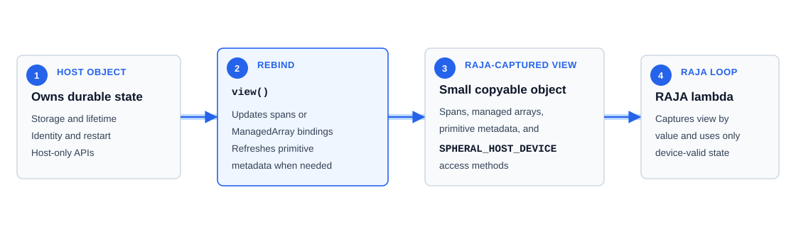
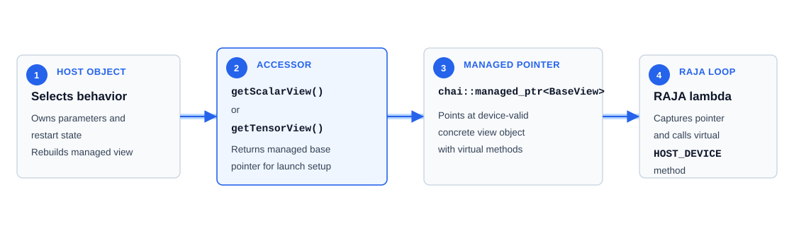

Value/View and Device Execution Model
=====================================

Purpose
-------

This document defines the object shapes Spheral currently uses at the boundary
between long-lived host objects and device-capable RAJA loops. It is the
contract page for the pattern; concrete class families are described in
:doc:`value_view_conversion_case_studies`, and launch mechanics are described in
:doc:`raja_chai_execution_patterns`.

In this context, a RAJA-captured object is the object that setup code makes
available to a RAJA lambda. It may be a small view object, or it may be a managed
view object whose host/device methods are called from the RAJA loop body. The
matching host object is included when it owns the data or configuration and
produces the RAJA-captured object.

This page uses RAJA loop or RAJA lambda for the accelerator launch body. SPH
kernel refers only to interpolation-kernel objects such as ``TableKernel``.

The recurring split is:

* long-lived C++ host objects own storage, identity, registration, restart
  behavior, resizing, and host-side APIs;
* RAJA-captured objects are lightweight, copyable, and limited to data and
  behavior that can participate in host/device RAJA loops;
* RAJA lambdas receive views or managed view pointers rather than the full host
  object graph.

RAJA-Captured Object Shapes
---------------------------

Device-capable RAJA loops need a narrower representation than the host object
usually contains. The current captured representations expose:

* small view objects and primitive values captured by value in RAJA lambdas;
* methods annotated with ``SPHERAL_HOST_DEVICE`` when they run in RAJA loops;
* spans, CHAI-managed arrays, or managed pointers valid in the selected
  execution space;
* primitive metadata needed by the RAJA loop body;
* no traversal of host-only object graphs inside the RAJA lambda body.

Two related shapes appear in the current code.

Value/View Shape
~~~~~~~~~~~~~~~~

The value/view shape appears where device code needs direct access to data
owned by an object that also carries host-only responsibilities.

The host object keeps responsibilities such as:

* storage lifetime;
* registration with ``NodeList``, ``State``, or package infrastructure;
* restart and serialization;
* resizing, deletion, reordering, and layout changes;
* Python-facing semantics;
* host-only lookup maps and helper containers.

The view keeps responsibilities such as:

* indexed data access;
* primitive metadata needed by the algorithm;
* ``move``, ``touch``, and ``data`` hooks when it owns CHAI-managed data;
* small helper methods that are valid on host and device.

Managed Pointer Shape for Runtime-Selected Behavior
~~~~~~~~~~~~~~~~~~~~~~~~~~~~~~~~~~~~~~~~~~~~~~~~~~~

This shape appears where device code needs to call behavior selected at
runtime. The artificial-viscosity family is the current example.

Prefer host-side type selection or concrete value views when the RAJA loop can be
specialized before launch. Use a managed pointer with a virtual method call only
when the runtime choice must remain inside the device loop. In the current
code, this is used for ``ArtificialViscosityView::QPiij``.

The managed view is an object with behavior, not just a span over host-object
storage. The C++ virtual-method machinery has to be valid on device, so the
host object constructs or recreates the managed view object when its concrete
parameters change. RAJA lambdas capture the managed pointer, not the host
``ArtificialViscosity`` object.

Device Memory Semantics
-----------------------

Spheral abstracts host/device storage with a small number of conventions.

``SPHERAL_HOST_DEVICE``
  Expands to RAJA's host/device annotation. It appears on small methods that run
  inside RAJA loops.

``SPHERAL_UNIFIED_MEMORY`` / ``USE_UVM``
  Select span/UVM behavior. In this mode many explicit CHAI movement operations
  become no-ops because the pointer is already unified.

``chai::ManagedArray``
  Used in non-UVM builds to wrap host-owned storage and make it movable between
  execution spaces.

``chai::managed_ptr``
  Used for managed device-callable objects, currently artificial-viscosity view
  objects.

``move(space)``
  Requests that CHAI move data to ``chai::CPU`` or ``chai::GPU``.

``touch(space)``
  Registers that data was accessed in an execution space without necessarily
  moving immediately.

``data(space, do_move)``
  Returns a pointer in the requested execution space, optionally moving first.

The host-object/view pattern does not eliminate the need to reason about data
movement. It gives each container one local place to implement movement
behavior, and it gives RAJA setup code a clear set of captured objects to move
or touch before launch.

RAJA-Captured Object Lifetime and Rebinding
-------------------------------------------

RAJA-captured objects are shallow launch-time handles. A previously created
view or managed pointer can become invalid or out of date when the host object
changes storage, layout, membership, node counts, pair ordering, or
runtime-selected configuration. Recreate, rebind, or reacquire captured objects
after changes such as:

* field assignment, resizing, deletion, or deserialization;
* node-list internal or ghost count changes;
* ghost creation, culling, or deletion;
* domain redistribution;
* field-list membership changes;
* pair-related storage reallocation after connectivity changes;
* artificial-viscosity coefficient or option changes that recreate the managed
  view object;
* destruction of scratch host objects.

RAJA setup code commonly creates captured objects immediately before the RAJA
loops that consume them, and then reacquires those objects after operations that
change the host object state.

Relationship to the Other Design Docs
-------------------------------------

:doc:`value_view_conversion_case_studies` is the current family reference. It
answers which host object owns the data, what object is captured by RAJA
lambdas, how that object is made current, and when old views should not be
reused. Its :ref:`current-raja-captured-source-map` section is the
implementation source-file index for these object families.

:doc:`raja_chai_execution_patterns` explains how RAJA launch code gathers host
objects, creates views, moves/touches data, launches RAJA loops, and returns
written data to CPU consumers.

:doc:`connectivity_data_structures` explains how connectivity construction
produces the flattened ``NodePairList`` consumed through ``NodePairListView``.
