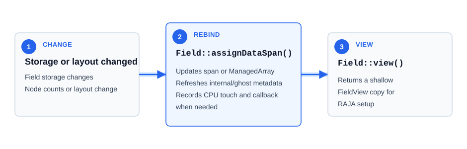
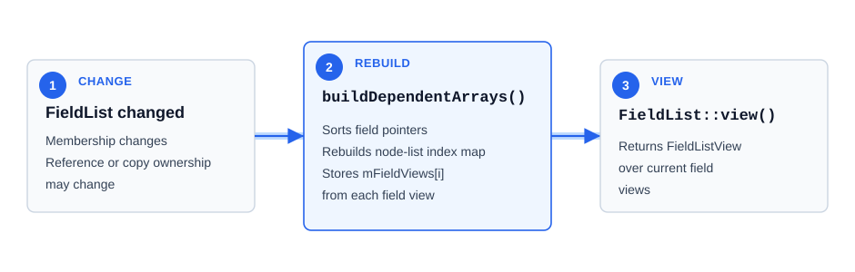
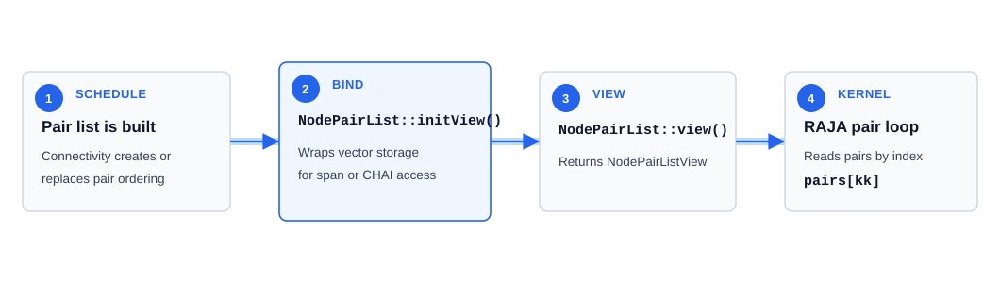
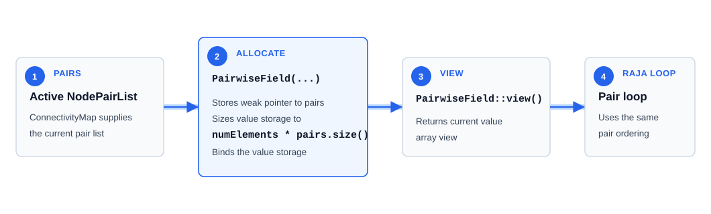
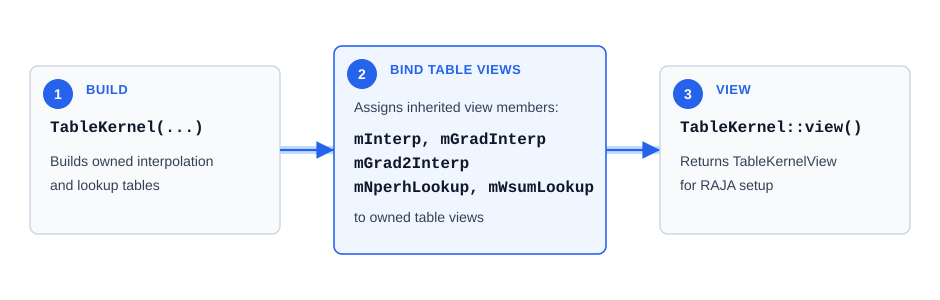
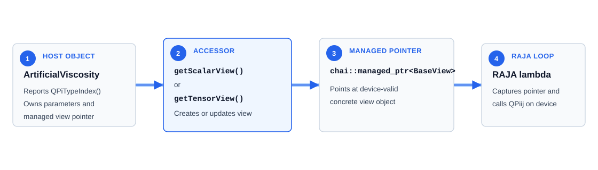

Current Kernel-Facing Object Families
=====================================

Purpose
-------

This document is the concrete family reference for Spheral's current
kernel-facing object model. It complements
:doc:`value_view_and_device_execution_model`, which defines the value/view and
managed view pointer shapes, and :doc:`raja_chai_execution_patterns`, which
describes how those objects are used around RAJA launches.

Each family section answers four practical kernel-setup questions:

* What stays alive on the host? This is the object that owns storage or
  configuration and enforces the rules for keeping that data valid.
* What is passed to the kernel? This is the view object or managed pointer that
  a RAJA lambda captures. The family section also names the indexed accessors
  or ``SPHERAL_HOST_DEVICE`` methods that kernel code calls through that object.
* How is that kernel-facing object made current? This is the constructor,
  ``view()``, ``initView()``, ``assignDataSpan()``, or accessor that binds the
  kernel-facing object to the current host-side data before launch.
* When should an old view not be reused? These are the host-object changes that
  can leave a previously captured object pointing at out-of-date storage,
  out-of-date membership, or the wrong pair ordering.

Family Overview
---------------

The current RAJA-facing object model is organized around long-lived host
objects and small kernel-facing objects:

* field and field-list views expose node-indexed simulation state;
* pair-list and pairwise-field views expose flattened pair schedules and data
  aligned to those schedules;
* kernel and interpolator views expose tabulated lookup data for SPH
  evaluations;
* artificial-viscosity managed views preserve behavior that must be selected at
  runtime inside the kernel.

``FieldBase``, ``Field``, and ``FieldView``
-------------------------------------------

``Field<Dimension, DataType>`` is the primary value/view example. It owns one
value of ``DataType`` per node on one ``NodeList``. It inherits the typed view
interface from ``FieldView<Dimension, DataType>`` while ``FieldBase<Dimension>``
provides the host-side type-erased interface.

Host object:

* ``Field`` owns ``std::vector<DataType, DataAllocator<DataType>> mDataArray``;
* ``FieldBase`` supports boundary dispatch, restart registration, serialization,
  packing, cloning, and generic state registration;
* ``Field`` responds to node-list resizing, deletion, reordering, copying, and
  deserialization.

Kernel-facing object:

* ``FieldView`` stores ``mDataSpan`` plus primitive metadata such as internal
  and ghost counts;
* ``operator()``, ``operator[]``, and ``at`` provide typed indexed access;
* ``move``, ``touch``, and ``data`` manage CHAI-backed storage where needed;
* element accessors used by kernels are marked ``SPHERAL_HOST_DEVICE``.

How kernels get a current view:

``FieldBase`` is intentionally not the inner-loop interface. Kernels use typed
``FieldView`` objects or field-list views built from them.

When old views should not be reused:

* resizing, deletion, reordering, copying, or deserialization can rebind the
  field storage or change the node counts recorded in the view;
* take a fresh ``Field::view()`` after those host-object changes, after
  ``Field::assignDataSpan()`` has updated the storage binding.

``FieldList`` and ``FieldListView``
-----------------------------------

``FieldList<Dimension, DataType>`` aggregates same-typed fields across node
lists. It may reference fields owned elsewhere or own copied fields in
``mFieldCache``.

Host object:

* ``FieldList`` manages field membership and reference-vs-copy storage mode;
* ``buildDependentArrays`` sorts fields in ``NodeListRegistrar`` order;
* the host object maintains typed field pointers, ``FieldBase`` pointers,
  node-list pointers, and node-list index maps.

Kernel-facing object:

* ``FieldListView`` stores an array of ``FieldView`` objects;
* kernels use ``operator()(fieldIndex, nodeIndex)`` for direct value access;
* arithmetic, local reductions, and size/count queries operate over the view;
* ``move(space, recursive=true)`` can move both the outer array and each nested
  field view's data.

How kernels get a current view:

This lets a RAJA kernel use syntax such as ``mass(nodeListi, i)`` while the
host object preserves node-list ordering, type-erased compatibility, and field
membership semantics.

When old views should not be reused:

* changing field membership, reference-vs-copy ownership, cached fields, or
  node-list ordering requires rebuilding the dependent arrays;
* a ``FieldListView`` contains shallow ``FieldView`` copies, so it does not
  automatically track later changes to the ``FieldList`` or its member fields.

``NodePairList`` and ``NodePairListView``
------------------------------------------

``NodePairList`` is the host-object/view family for an already-built flat pair
schedule. ``NodePairListView`` is the kernel-facing object captured by RAJA pair
kernels.

Host object:

* ``NodePairList`` owns ``std::vector<NodePairIdxType>``;
* the host object has lookup support for mapping a pair value to an index;
* connectivity construction replaces or updates the ``NodePairList`` when
  pair topology changes.

Kernel-facing object:

* ``NodePairListView`` holds a span or ``chai::ManagedArray`` over the pair
  vector;
* kernels index it by integer pair position with ``pairs[kk]``;
* the view exposes pair-array size, data pointer, movement, and touch.

How kernels get a current view:

``ConnectivityMap`` is important context for this family because it builds and
provides the current ``NodePairList``. The kernel-facing family member remains
``NodePairListView``.

When old views should not be reused:

* connectivity updates can replace the ``NodePairList`` and change pair order;
* mutating the pair vector with ``fill``, ``insert``, or ``clear`` changes the
  storage exposed by the view;
* take a fresh ``NodePairList::view()`` after pair-list construction or
  mutation.

``PairwiseField`` and ``PairwiseFieldView``
--------------------------------------------

``PairwiseField<Dimension, Value, numElements>`` stores values indexed by the
active pair-list position rather than by node. It is intentionally ephemeral
because connectivity can change step to step.

Host object:

* ``PairwiseField`` stores a weak pointer to the active ``NodePairList``;
* the host object sizes ``mArray`` to ``numElements * pairs.size()``;
* host code can access values by ``NodePairIdxType`` through the pair-list
  lookup.

Kernel-facing object:

* ``PairwiseFieldView`` exposes strided indexed access over the value array;
* kernels use integer pair-index access aligned with ``NodePairListView``
  traversal;
* movement and touch operate on the pairwise-value storage.

How kernels get a current view:

The view does not know how pair ids map to indices. Rebuilding or patching
connectivity can orphan the host-side pair association and invalidate existing
views.

When old views should not be reused:

* the field is tied to the ``NodePairList`` used at construction time;
* rebuilding connectivity can replace that pair list, changing both lifetime
  and pair-index ordering;
* use a ``PairwiseFieldView`` only with the matching ``NodePairListView``
  traversal from the same connectivity state.

``TableKernel`` and ``TableKernelView``
----------------------------------------

``TableKernel<Dimension>`` owns tabulated interpolation data for SPH kernel
evaluation. ``TableKernelView<Dimension>`` is the kernel-facing object used by
RAJA hydro kernels.

Host object:

* ``TableKernel`` owns interpolation tables such as ``mInterpVal``,
  ``mGradInterpVal``, and ``mGrad2InterpVal``;
* the host object initializes lookup tables from the selected kernel;
* construction binds the inherited view members to those owned lookup tables.

Kernel-facing object:

* ``TableKernelView`` contains interpolator views and primitive lookup metadata;
* kernels call host/device methods such as ``kernelValue``, ``gradValue``,
  ``grad2Value``, and ``kernelAndGradValue``;
* ``TableKernelView::move`` recursively moves nested interpolator views.

The nested movement is the same general issue as ``FieldListView`` movement:
moving only the outer object is not sufficient when it contains managed data in
its child views.

How kernels get a current view:

When old views should not be reused:

* a ``TableKernelView`` is tied to the lookup tables of the ``TableKernel`` it
  came from;
* construct or select the final ``TableKernel`` before taking the view for a
  launch;
* when running with explicit CHAI movement, move the ``TableKernelView`` so its
  nested interpolator views move with it.

``ArtificialViscosity`` and ``ArtificialViscosityView``
--------------------------------------------------------

Artificial viscosity follows the host-object/kernel-facing split but uses a
managed pointer for behavior selected at runtime rather than a plain value view.
The kernel-facing object is a ``chai::managed_ptr`` to an
``ArtificialViscosityView<Dimension, QPiType>`` base object.

Host object:

* ``ArtificialViscosity`` descendants own host parameters, package-facing APIs,
  restart identity, and configuration setters;
* concrete classes choose which concrete view class represents them;
* setters update host values and update existing managed views.

Kernel-facing object:

* ``ArtificialViscosityView`` defines the virtual ``SPHERAL_HOST_DEVICE``
  ``QPiij`` interface;
* concrete view descendants contain only the data and methods needed by kernels;
* RAJA pair kernels capture a ``chai::managed_ptr`` to the base view and call
  ``Q->QPiij(...)``.

How kernels get a current managed pointer:

Host code first selects the scalar or tensor templated path. The only behavior
still chosen at runtime inside that path is the concrete artificial-viscosity
calculation. This keeps most type selection on the host while preserving the
runtime behavior that the pair kernel needs.

When old managed pointers should not be reused:

* changing artificial-viscosity coefficients or options updates the host object
  and can require the concrete managed view to be recreated;
* use the host-object accessor, such as ``getScalarView()`` or
  ``getTensorView()``, during kernel setup instead of caching a pointer across
  host-object configuration changes.

.. _current-kernel-facing-source-map:

Source Map by Family
--------------------

Use this map as an implementation reference after the host and kernel-facing
roles above are clear.

Field and field-list families:

* ``src/Field/FieldBase.hh``
* ``src/Field/Field.hh`` and ``src/Field/FieldInline.hh``
* ``src/Field/FieldView.hh`` and ``src/Field/FieldViewInline.hh``
* ``src/Field/FieldList.hh`` and ``src/Field/FieldListInline.hh``
* ``src/Field/FieldListView.hh`` and ``src/Field/FieldListViewInline.hh``

Pair and pairwise-value families:

* ``src/Neighbor/NodePairList.hh`` and ``src/Neighbor/NodePairList.cc``
* ``src/Neighbor/NodePairListView.hh``
* ``src/Neighbor/PairwiseField.hh`` and ``src/Neighbor/PairwiseFieldInline.hh``
* ``src/Neighbor/PairwiseFieldView.hh``
* ``src/Neighbor/PairwiseFieldElementAccessor.hh``

Kernel and interpolation families:

* ``src/Kernel/TableKernel.hh`` and ``src/Kernel/TableKernel.cc``
* ``src/Kernel/TableKernelInline.hh``
* ``src/Kernel/TableKernelView.hh`` and ``src/Kernel/TableKernelViewInline.hh``
* ``src/Utilities/QuadraticInterpolatorView.hh``
* ``src/Utilities/CubicHermiteInterpolatorView.hh``

Managed-pointer family with behavior selected at runtime:

* ``src/ArtificialViscosity/ArtificialViscosity.hh``
* ``src/ArtificialViscosity/ArtificialViscosityView.hh``
* concrete artificial-viscosity classes and view implementations

Shared Observations
-------------------

Across the current families:

* host objects define lifetime and invariants;
* views expose the smallest useful kernel-facing API;
* host setup chooses concrete types and gathers state before launch;
* kernels capture views or managed view pointers, not package-level host
  objects;
* whether a view is current depends on storage, membership, and pair ordering
  remaining unchanged after the view is created;
* managed pointers are reserved for behavior that cannot be selected entirely on
  the host side before launch.

The important distinction is the responsibility split, not the class-name
pairing itself.
